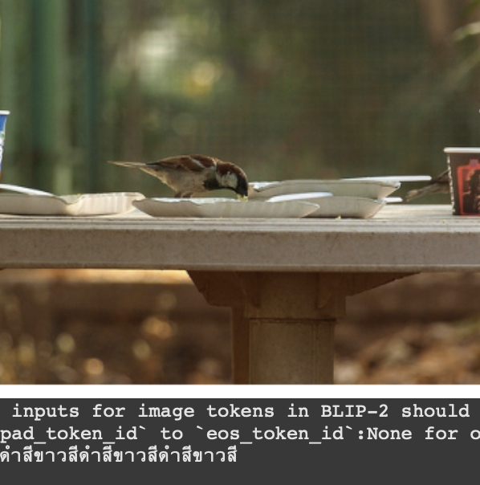
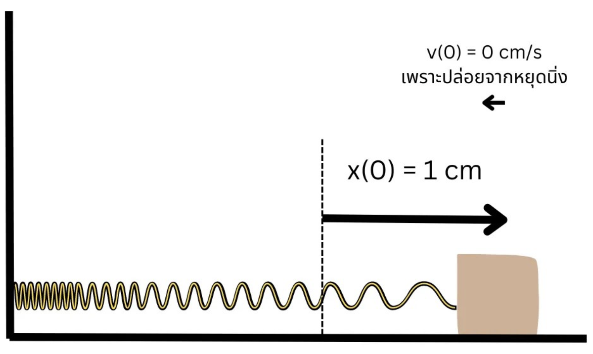
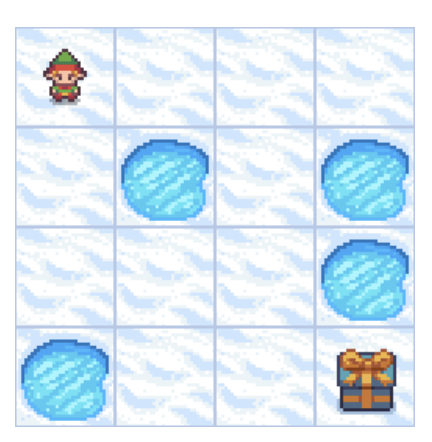

# Portfolio

This is Sirawit Khantarak's portfolio, showcasing my projects in Data Science and AI Engineering across various fields.

 

<table>
    <tr>
        <td colspan="2">
            [Multimodal: Image-to-Text] Pipeline for Fine-Tuning a Thai Language Image Captioning Model
            <a href="showcase_blip2_imgcapt4th.ipynb">[Code]</a>
        </td>
    </tr>
    <tr>
        <td width="300" valign="top">
            
        </td>
        <td width="300" valign="top">
            A pipeline for fine-tuning the BLIP-2 model on the task of Thai language
            image captioning. This is a simple guideline with some explanations.
            You can try this yourself, but you will need to adjust some configurations
            for real-world applications.
              
            ไปป์ไลน์สอนการเทรนโมเดล BLIP-2 สำหรับทำ AI บรรยายภาพภาษาไทย
            สอนตัดต่อโมเดล เอาโมเดลภาษาไทยมาใส่ พร้อมคำอธิบายเบื้องต้น
            สามารถนำไปใช้ต่อได้แต่ต้องปรับค่าต่าง ๆ ตามความเหมาะสม
        </td>
    </tr>
</table>

 

<table>
    <tr>
        <td colspan="2">
            [Mathematical Modeling] Solving Differential Equations with Neural Networks
            <a href="lagaris_method_pytorch.ipynb">[Code]</a>
        </td>
    </tr>
    <tr>
        <td width="300" valign="top">
            
        </td>
        <td width="300" valign="top">
            My final project at the Computational Physics Lab. Rather than using
            neural networks for tasks like regression or classification, here I
            explore their capability for function approximation. The target is
            the differential equation of a mass-spring system.
              
            งานไฟนอลโปรเจคจากภาควิชาฟิสิกส์ (แล็บฟิสิกส์เชิงคำนวณ)
            เป็นการนำ Neural Networks มาใช้แก้สมการอนุพันธ์
            โดยเลือกระบบมวลติดสปริงเป็นตัวอย่าง
        </td>
    </tr>
</table>

 

<table>
    <tr>
        <td colspan="2">
            [Reinforcement Learning] Implementation of Temporal Difference Q-Learning
            <a href="frozen_lake_offpolicy_td_qlearning.ipynb">[Code]</a>
        </td>
    </tr>
    <tr>
        <td width="300" valign="top">
            
        </td>
        <td width="300" valign="top">
            My tutorial on how to implement a reinforcement learning algorithm,
            Temporal Difference Q-learning, where I use the Frozen Lake environment
            from Gymnasium as a showcase. This notebook works best when coupled
            with my tutorial video on YouTube; however, it is explained in Thai.
              
            สอน coding from scratch วิธีการสร้าง AI เล่นเกมด้วย
            Temporal Difference Q-learning สามารถเข้าไปฟังคลิปสอนของผมใน
            <a href="https://www.youtube.com/watch?v=vDDucTB6mig">YouTube Video</a>
            นี้ได้ ซึ่งจะอธิบายคอนเซปท์ของตัวเทคนิคนี้
        </td>
    </tr>
</table>
